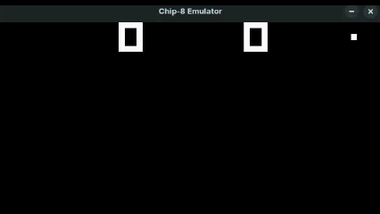

# About this Project

This project is a little experiment of mine with the Rust programming language and systems emulators.

It emulates the former gaming console Chip-8.

 

## Requirements

To build and run this emulator, you will need to have the Rust toolchain installed on your system. Additionally, the SDL2 library is required for audio and video support. On Linux, you can usually install it with your package manager (for example, `libsdl2-dev`).

## Usage

To try out the emulator, simply run ```cargo run``` at the root directory. The program will, then, ask for one of the files at the **roms** directory. Once you insert the name of one of the files, you may press Enter and start playing.

To emulate the original 16-keys keyboard of Chip-8 consoles, the modern keyboard input is "translated" as follows:

<div align="center">
Chip <====> Modern

| 1 | 2 | 3 | C |         | 1  | 2   | 3 | 4 |
|---|---|---|---|---------|----|-----|---|---|
| 4 | 5 | 6 | D | <-----> | Q  | W   | E | R |
| 7 | 8 | 9 | E |         | A  | S   | D | F |
| A | 0 | B | F |         | Z  | X   | C | V |
</div>